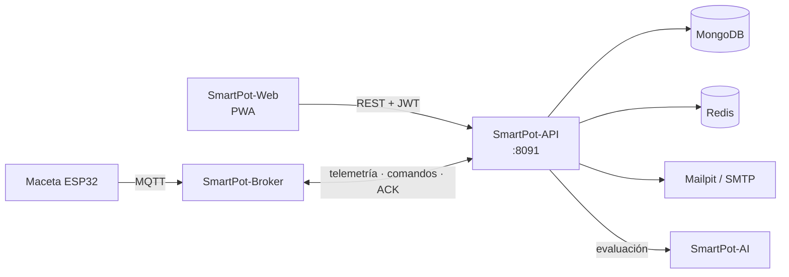

# SmartPot-API

## Estado del Proyecto

[](https://github.com/SmartPotTech/SmartPot-API/actions/workflows/maven.yml)
[](https://github.com/SmartPotTech/SmartPot-API/actions/workflows/codeql.yml)
[](https://github.com/SmartPotTech/SmartPot-API/actions/workflows/packaging.yml)

## Descripción

SmartPot-API es el núcleo de **SmartPot**: una API REST en **Spring Boot 4.1** y **Java 21** que conecta las macetas hidropónicas con la aplicación web. Recibe la telemetría por **MQTT**, la guarda en **MongoDB**, envía comandos a los actuadores, administra las credenciales de cada dispositivo en el broker y consulta al **asistente de IA** para diagnosticar cada cultivo y, si el usuario lo permite, actuar por su cuenta.



## Estructura del Proyecto

Cada dominio sigue la misma organización por capas: `controller`, `service`, `repository`, `mapper` y `model` (`dto` y `entity`).

```text
src/main/java/app/smartpot/api/
├── actuators/       # Bomba, luz UV, ventilador y demás salidas de la maceta
├── ai/              # Cliente del servicio de IA, evaluación de salud y agente de automatización
├── cache/           # Contadores y enfriamientos en Redis con respaldo en memoria
├── commands/        # Comandos por MQTT: PENDING → SENT → EXECUTED | FAILED | EXPIRED
├── config/          # Propiedades, prefijo /api/v1, OpenAPI y reloj
├── crops/           # Cultivos, modo automático y credenciales del dispositivo
├── exception/       # Errores de negocio y respuestas de error en español
├── health/          # /health para despliegues y balanceadores
├── mail/            # Correos de bienvenida y de recuperación de contraseña
├── mqtt/            # Cliente Paho, tópicos v1, parser de telemetría y aprovisionamiento en Mosquitto
├── notifications/   # Alertas del cultivo, del dispositivo y del asistente
├── overview/        # Panel general: totales, series comparativas y análisis de flota de la IA
├── readings/        # Lecturas, resumen estadístico y exportación CSV
├── security/        # JWT, CORS, límite de peticiones, AES-GCM y autenticación
└── users/           # Perfil, cambio de contraseña y borrado de cuenta
```

## Contrato REST

Base local `http://localhost:8091`, producción `https://api.smartpot.app`. Las rutas de negocio viven bajo `/api/v1` y usan `Authorization: Bearer <token>`. La documentación interactiva está en `/docs` y el esquema en `/v3/api-docs`.

| Método | Ruta | Acceso |
| --- | --- | --- |
| GET | `/health` → `{"status","database","broker","cache","ai"}` (503 si la base cae) | Público |
| POST | `/api/v1/auth/register` `{name,lastName,email,password}` → `{token,expiresAt,user}` | Público |
| POST | `/api/v1/auth/login` `{email,password}` | Público |
| POST | `/api/v1/auth/password/forgot` `{email}` → 202 siempre | Público |
| POST | `/api/v1/auth/password/reset` `{token,password}` → 204 | Público |
| GET | `/api/v1/crop-profiles` (rangos óptimos por especie) | Público |
| GET PUT DELETE | `/api/v1/users/me` (PUT `{name,lastName}`) | JWT |
| PUT | `/api/v1/users/me/password` `{currentPassword,newPassword}` | JWT |
| GET POST | `/api/v1/crops` (POST `{name,type}` devuelve la clave del dispositivo una sola vez) | JWT |
| PUT | `/api/v1/crops/automation` `{cropIds?,enabled}` (modo automático en varios cultivos; sin ids, en todos) | JWT |
| GET PUT DELETE | `/api/v1/crops/{id}` | JWT, solo el dueño |
| PUT | `/api/v1/crops/{id}/automation` `{enabled}` | JWT, solo el dueño |
| GET | `/api/v1/crops/{id}/device` (broker, usuario y tópicos) | JWT, solo el dueño |
| POST | `/api/v1/crops/{id}/device/key` (rota la clave y desconecta la sesión anterior) | JWT, solo el dueño |
| GET POST | `/api/v1/crops/{id}/readings` (`from`, `to`, `limit`) | JWT, solo el dueño |
| GET | `/api/v1/crops/{id}/readings/latest`, `/summary?hours=24`, `/export` (CSV) | JWT, solo el dueño |
| GET POST DELETE | `/api/v1/crops/{id}/actuators`, `/actuators/{actuatorId}` | JWT, solo el dueño |
| GET POST | `/api/v1/crops/{id}/commands` (POST `{actuatorId,action,durationSeconds}` → 202) | JWT, solo el dueño |
| GET | `/api/v1/crops/{id}/insights` (diagnóstico del asistente de IA con pronósticos) | JWT, solo el dueño |
| GET | `/api/v1/overview` (totales de la cuenta y cada cultivo con su última lectura) | JWT |
| GET | `/api/v1/overview/series?metric=temperature&hours=24` (promedios por intervalo para comparar cultivos) | JWT |
| GET | `/api/v1/overview/fleet` (ranking, problemas compartidos, grupos y acciones en bloque de la IA) | JWT |
| GET | `/api/v1/commands?limit=50` (comandos de todos los cultivos) | JWT |
| POST | `/api/v1/commands/bulk` `{cropIds?,actuatorType,action,durationSeconds}` → 202 con el resultado por cultivo | JWT |
| GET | `/api/v1/notifications` (`unreadOnly`, `limit`), `/unread-count` | JWT |
| PUT DELETE | `/api/v1/notifications/{id}/read`, `/read-all`, `/{id}` | JWT |

- Tipos de cultivo: `TOMATO`, `LETTUCE`, `STRAWBERRY`, `BASIL`, `SPINACH`, `PEPPER`.
- Actuadores: `WATER_PUMP`, `UV_LIGHT`, `FAN`, `HUMIDIFIER`, `NUTRIENT_DOSER`, `PH_DOSER`. Al crear un cultivo se agregan la bomba, la luz UV y el ventilador.
- Contraseñas de 8 caracteres a 72 bytes con mayúscula, minúscula y número (BCrypt de costo 12).
- Un cultivo de otra cuenta responde **404**, igual que uno inexistente, para no revelar qué ids existen.
- Límite por IP: 300 peticiones por minuto y 10 por minuto en `/api/v1/auth/*`. Responde 429 con `Retry-After`.

## MQTT

La API es la cuenta administradora de [SmartPot-Broker](https://github.com/SmartPotTech/SmartPot-Broker). Al arrancar crea el rol `device` y sincroniza las cuentas de todos los cultivos; al crear, rotar o borrar un cultivo actualiza su cuenta. Cada maceta se conecta con **usuario = id del cultivo** y la **clave del dispositivo**, que la API guarda cifrada con AES-256-GCM.

| Tópico | Sentido | Carga |
| --- | --- | --- |
| `smartpot/v1/{cropId}/telemetry` | Maceta → API | `{"temperature":24.5,"humidity":61,"brightness":710,"ph":6.1,"tds":820,"atmosphere":1012.8,"soilMoisture":55}` |
| `smartpot/v1/{cropId}/commands` | API → maceta | `{"id":"…","actuator":"WATER_PUMP","action":"ACTIVATE","durationSeconds":30}` |
| `smartpot/v1/{cropId}/commands/ack` | Maceta → API | `{"id":"…","status":"EXECUTED","message":"Bomba encendida"}` |
| `smartpot/v1/{cropId}/status` | Maceta (retenido y última voluntad) | `online` / `offline` |

La telemetría fuera de rango físico se descarta y cada cultivo guarda como máximo una lectura cada 5 segundos. Un comando sin ACK en 2 minutos pasa a `EXPIRED` y avisa al dueño.

## Asistente de IA

Cada lectura dispara al agente de automatización: la envía a [SmartPot-AI](https://github.com/SmartPotTech/SmartPot-AI) junto con el historial reciente y los actuadores del cultivo. El servicio responde con un índice difuso de salud, el diagnóstico del sistema experto, las predicciones de los modelos y las acciones sugeridas. La API guarda el índice en el cultivo, avisa de los hallazgos críticos y, con el **modo automático** activo, ejecuta las acciones con un enfriamiento de 10 minutos por actuador. El historial viaja con la hora de cada lectura, así el asistente calcula tendencias y actúa antes de que una variable salga de su rango.

El **panel general** (`/api/v1/overview`) mira la cuenta completa: las series comparativas se agregan en MongoDB con `$dateTrunc` (unos 48 puntos por cultivo) y el análisis de flota pide a la IA el ranking, los problemas que comparten varios cultivos y las acciones sugeridas en bloque, que se aplican con `/api/v1/commands/bulk`.

## Guía de Instalación

### Requisitos Previos

- Java 21 y Maven 3.9 (o solo Docker)
- MongoDB, Redis, Mailpit, el broker y el servicio de IA: el entorno completo está en [SmartPotTech/.github](https://github.com/SmartPotTech/.github)

### Ejecución local

```bash
git clone https://github.com/SmartPotTech/SmartPot-API.git
cd SmartPot-API
cp .env.example .env    # completa secretos y conexiones
./mvnw spring-boot:run
```

La API lee `.env` desde la carpeta del proyecto (`spring.config.import`). `SMARTPOT_JWT_SECRET` y `SMARTPOT_AES_KEY` no tienen valor por defecto: sin ellos la API no arranca.

### Pruebas

```bash
./mvnw verify
```

Sin Java instalado:

```bash
docker run --rm -v smartpot-m2:/root/.m2 -v "$PWD":/workspace -w /workspace maven:3.9-eclipse-temurin-21 mvn -B verify
```

Cubren cifrado, JWT, política de contraseñas, tópicos y telemetría MQTT, aprovisionamiento en el broker, comandos, cultivos, el agente de automatización, la caché con respaldo local y la cadena de seguridad de los controladores.

### Imagen Docker

```bash
docker build -t smartpot-api .
docker pull ghcr.io/smartpottech/smartpot-api:latest
```

La imagen compila con Maven en una etapa aparte, corre como el usuario `1000`, admite sistema de archivos de solo lectura con `tmpfs` en `/tmp` y trae un `HEALTHCHECK` sobre `/health`.

## Licencia

Este proyecto está bajo la licencia MIT. Consulta el archivo [LICENSE](LICENSE) para más detalles.
