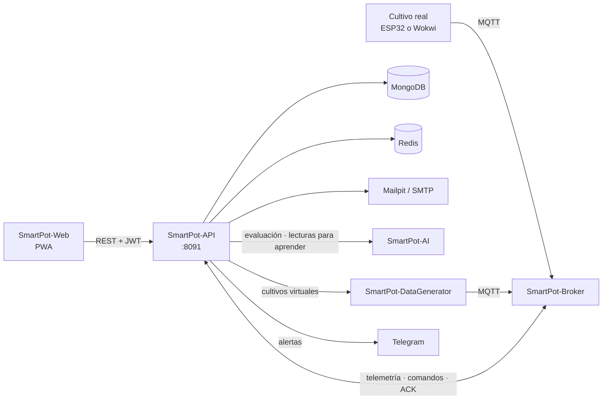

# SmartPot-API

## Estado del Proyecto

[](https://github.com/SmartPotTech/SmartPot-API/actions/workflows/maven.yml)
[](https://github.com/SmartPotTech/SmartPot-API/actions/workflows/codeql.yml)
[](https://github.com/SmartPotTech/SmartPot-API/actions/workflows/packaging.yml)

## Descripción

SmartPot-API es el núcleo de **SmartPot**: una API REST en **Spring Boot 4.1** y **Java 21** que conecta los cultivos
hidropónicos, reales o virtuales, con la aplicación web. Recibe la telemetría por **MQTT**, la guarda en **MongoDB**,
envía comandos a los actuadores, administra las credenciales de cada dispositivo en el broker y consulta al **asistente
de IA** para diagnosticar cada cultivo y, si el usuario lo permite, actuar por su cuenta.



## Estructura del Proyecto

Cada dominio sigue la misma organización por capas: `controller`, `service`, `repository`, `mapper` y `model` (`dto` y
`entity`).

```text
src/main/java/app/smartpot/api/
├── actuators/       # Bomba, luz UV, ventilador y demás salidas de cada cultivo
├── ai/              # Cliente del servicio de IA, evaluación de salud y agente de automatización
├── cache/           # Contadores y enfriamientos en Redis con respaldo en memoria
├── channels/        # Canales externos de notificación (hoy Telegram) y su bot
├── commands/        # Comandos por MQTT: PENDING → SENT → EXECUTED | FAILED | EXPIRED
├── config/          # Propiedades, prefijo /api/v1, OpenAPI y reloj
├── crops/           # Cultivos reales o virtuales, su forma, modo automático y credenciales
├── exception/       # Errores de negocio y respuestas de error en español
├── health/          # /health para despliegues y balanceadores
├── mail/            # Correos de bienvenida y de recuperación de contraseña
├── mqtt/            # Cliente Paho, tópicos v1, parser de telemetría y aprovisionamiento en Mosquitto
├── notifications/   # Alertas del cultivo, del dispositivo y del asistente
├── overview/        # Panel general: totales, series comparativas y análisis de flota de la IA
├── readings/        # Lecturas, resumen estadístico y exportación CSV
├── security/        # JWT, CORS, límite de peticiones, AES-GCM y autenticación
├── users/           # Perfil, cambio de contraseña y borrado de cuenta
└── virtualdevices/  # Simulación de los cultivos virtuales: configuración, pausa y proxy al simulador
```

## Contrato REST

Base local `http://localhost:8091`, producción `https://api.smartpot.app`. Las rutas de negocio viven bajo `/api/v1` y
usan `Authorization: Bearer <token>`. La documentación interactiva está en `/docs` y el esquema en `/v3/api-docs`.

| Método          | Ruta                                                                                                                                          | Acceso             |
|-----------------|-----------------------------------------------------------------------------------------------------------------------------------------------|--------------------|
| GET             | `/health` → `{"status","database","broker","cache","ai","simulator"}` (503 si la base cae)                                                    | Público            |
| POST            | `/api/v1/auth/register` `{name,lastName,email,password}` → `{token,expiresAt,user}`                                                           | Público            |
| POST            | `/api/v1/auth/login` `{email,password}`                                                                                                       | Público            |
| POST            | `/api/v1/auth/password/forgot` `{email}` → 202 siempre                                                                                        | Público            |
| POST            | `/api/v1/auth/password/reset` `{token,password}` → 204                                                                                        | Público            |
| GET             | `/api/v1/crop-profiles` (rangos óptimos por especie)                                                                                          | Público            |
| GET PUT DELETE  | `/api/v1/users/me` (PUT `{name,lastName}`)                                                                                                    | JWT                |
| PUT             | `/api/v1/users/me/password` `{currentPassword,newPassword}`                                                                                   | JWT                |
| GET POST        | `/api/v1/crops` (POST `{name,type,kind,form,virtual?}`; si es real devuelve la clave del dispositivo una sola vez)                            | JWT                |
| PUT             | `/api/v1/crops/automation` `{cropIds?,enabled}` (modo automático en varios cultivos; sin ids, en todos)                                       | JWT                |
| GET PUT DELETE  | `/api/v1/crops/{id}`                                                                                                                          | JWT, solo el dueño |
| PUT             | `/api/v1/crops/{id}/automation` `{enabled}`                                                                                                   | JWT, solo el dueño |
| GET             | `/api/v1/crops/{id}/device` (broker, usuario y tópicos; solo cultivos reales)                                                                 | JWT, solo el dueño |
| POST            | `/api/v1/crops/{id}/device/key` (rota la clave y desconecta la sesión anterior; solo cultivos reales)                                         | JWT, solo el dueño |
| GET POST        | `/api/v1/crops/{id}/readings` (`from`, `to`, `limit`)                                                                                         | JWT, solo el dueño |
| GET             | `/api/v1/crops/{id}/readings/latest`, `/summary?hours=24`, `/export` (CSV)                                                                    | JWT, solo el dueño |
| GET POST DELETE | `/api/v1/crops/{id}/actuators`, `/actuators/{actuatorId}`                                                                                     | JWT, solo el dueño |
| GET POST        | `/api/v1/crops/{id}/commands` (POST `{actuatorId,action,durationSeconds}` → 202)                                                              | JWT, solo el dueño |
| GET             | `/api/v1/crops/{id}/insights` (diagnóstico del asistente de IA con pronósticos)                                                               | JWT, solo el dueño |
| GET             | `/api/v1/overview` (totales de la cuenta y cada cultivo con su última lectura)                                                                | JWT                |
| GET             | `/api/v1/overview/series?metric=temperature&hours=24` (promedios por intervalo para comparar cultivos)                                        | JWT                |
| GET             | `/api/v1/overview/fleet` (ranking, problemas compartidos, grupos y acciones en bloque de la IA)                                               | JWT                |
| GET             | `/api/v1/commands?limit=50` (comandos de todos los cultivos)                                                                                  | JWT                |
| POST            | `/api/v1/commands/bulk` `{cropIds?,actuatorType,action,durationSeconds}` → 202 con el resultado por cultivo                                   | JWT                |
| GET             | `/api/v1/notifications` (`unreadOnly`, `limit`), `/unread-count`                                                                              | JWT                |
| PUT DELETE      | `/api/v1/notifications/{id}/read`, `/read-all`, `/{id}`                                                                                       | JWT                |
| GET             | `/api/v1/channels` (canales del servidor y mis vínculos)                                                                                      | JWT                |
| POST            | `/api/v1/channels/telegram/link` → `{code,url,expiresAt}` (código de un solo uso, 10 minutos)                                                 | JWT                |
| PUT POST DELETE | `/api/v1/channels/links/{id}` `{enabled?,events?}`, `/links/{id}/test`, `/links/{id}`                                                         | JWT, solo el dueño |
| POST            | `/api/v1/channels/telegram/webhook` (modo webhook, firmado con `X-Telegram-Bot-Api-Secret-Token`)                                             | Telegram           |
| GET PUT DELETE  | `/api/v1/crops/{id}/virtual-device` (solo cultivos virtuales; PUT `{mode,manual?,location?,intervalSeconds?}` cambia o reanuda, DELETE pausa) | JWT, solo el dueño |
| GET             | `/api/v1/virtual-devices/places?q=` (lugares para el modo clima)                                                                              | JWT                |
| GET             | `/api/v1/ai/learning` (qué ha aprendido la IA: solo datos agregados por especie)                                                              | JWT                |

- Especies: `TOMATO`, `LETTUCE`, `STRAWBERRY`, `BASIL`, `SPINACH`, `PEPPER`.
- Tipo (`kind`): `REAL` o `VIRTUAL`, fijo al crear el cultivo (`REAL` si falta); cambiarlo responde 400.
- Forma (`form`): `POT`, `NFT`, `TOWER` o `RAFT` (`POT` si falta); se puede editar y solo cambia la ilustración de la
  PWA.
- Actuadores: `WATER_PUMP`, `UV_LIGHT`, `FAN`, `HUMIDIFIER`, `NUTRIENT_DOSER`, `PH_DOSER`. Un cultivo real nace con la
  bomba, la luz UV y el ventilador; uno virtual, con los seis.
- Contraseñas de 8 caracteres a 72 bytes con mayúscula, minúscula y número (BCrypt de costo 12).
- Un cultivo de otra cuenta responde **404**, igual que uno inexistente, para no revelar qué ids existen.
- Límite por IP: 300 peticiones por minuto y 10 por minuto en `/api/v1/auth/*`. Responde 429 con `Retry-After`.

## MQTT

La API es la cuenta administradora de [SmartPot-Broker](https://github.com/SmartPotTech/SmartPot-Broker). Al arrancar
crea el rol `device` y sincroniza las cuentas de todos los cultivos; al crear, rotar o borrar un cultivo actualiza su
cuenta. El dispositivo de cada cultivo se conecta con **usuario = id del cultivo** y la **clave del dispositivo**, que
la API guarda cifrada con AES-256-GCM.

| Tópico                              | Sentido                                  | Carga                                                                                                          |
|-------------------------------------|------------------------------------------|----------------------------------------------------------------------------------------------------------------|
| `smartpot/v1/{cropId}/telemetry`    | Dispositivo → API                        | `{"temperature":24.5,"humidity":61,"brightness":710,"ph":6.1,"tds":820,"atmosphere":1012.8,"soilMoisture":55}` |
| `smartpot/v1/{cropId}/commands`     | API → dispositivo                        | `{"id":"…","actuator":"WATER_PUMP","action":"ACTIVATE","durationSeconds":30}`                                  |
| `smartpot/v1/{cropId}/commands/ack` | Dispositivo → API                        | `{"id":"…","status":"EXECUTED","message":"Bomba encendida"}`                                                   |
| `smartpot/v1/{cropId}/status`       | Dispositivo (retenido y última voluntad) | `online` / `offline`                                                                                           |

La telemetría fuera de rango físico se descarta y cada cultivo guarda como máximo una lectura cada 5 segundos. Un
comando sin ACK en 2 minutos pasa a `EXPIRED` y avisa al dueño.

## Asistente de IA

Cada lectura nueva activa al agente de automatización, que evalúa el cultivo como máximo cada 30 segundos si tiene el
modo automático y cada 5 minutos si no: envía la lectura a [SmartPot-AI](https://github.com/SmartPotTech/SmartPot-AI)
junto con el historial reciente y los actuadores del cultivo. El servicio responde con un índice difuso de salud, el
diagnóstico del sistema experto, las predicciones de los modelos y las acciones sugeridas. La API guarda el índice en el
cultivo, avisa de los hallazgos críticos y, con el **modo automático** activo, ejecuta las acciones con un enfriamiento
de 10 minutos por actuador. El historial viaja con la hora de cada lectura, así el asistente calcula tendencias y actúa
antes de que una variable salga de su rango.

Cada lectura de un cultivo real también se encola para el **aprendizaje continuo** (las de los virtuales son sintéticas
y no se envían): cada minuto la API envía el lote a la IA (`/v1/learning/readings`) con la hora local; si la IA no
responde, el lote espera al siguiente ciclo (la cola guarda hasta 20 000 lecturas). Al borrar un cultivo la IA olvida
sus lecturas. La evaluación incluye `learning`: el estado de operación, si la lectura es atípica para la especie, la
probabilidad de necesitar riego o ventilación en la próxima hora y la humedad esperada del sustrato.

El **panel general** (`/api/v1/overview`) mira la cuenta completa: las series comparativas se agregan en MongoDB con
`$dateTrunc` (unos 48 puntos por cultivo) y el análisis de flota pide a la IA el ranking, los problemas que comparten
varios cultivos y las acciones sugeridas en bloque, que se aplican con `/api/v1/commands/bulk`.

## Notificaciones por Telegram

Las notificaciones de la PWA (alertas, desconexiones, acciones del asistente y comandos) se reenvían a los **canales
externos** que la persona vincule y a los tipos que elija. Los canales implementan `NotificationChannel`: sumar
WhatsApp, correo o Slack es una nueva implementación, sin tocar el resto. Hoy existe Telegram, centralizado en la API (
el dispositivo no habla con Telegram).

1. La PWA pide un código (`POST /api/v1/channels/telegram/link`) y abre `https://t.me/<bot>?start=<código>`.
2. El bot recibe `/start <código>`, lo valida (un solo uso, 10 minutos) y vincula ese chat a la cuenta.
3. Desde ahí llegan los avisos con un botón para abrir el cultivo; `/estado` resume los cultivos y `/desvincular` corta
   el envío.

Con `TELEGRAM_MODE=polling` la API consulta al bot con sondeo largo (sirve en local y en la demo, sin dirección
pública); en producción `webhook` registra `PUBLIC_API_URL/api/v1/channels/telegram/webhook` y valida el secreto de cada
llamada. Si Telegram rechaza los mensajes (chat bloqueado) o falla 5 veces seguidas, el vínculo se pausa.

## Cultivos Reales y Virtuales

Al crear un cultivo se elige, una sola vez, de dónde vienen sus lecturas. Uno **real** recibe la clave del dispositivo
para un ESP32 con el firmware, físico o simulado en Wokwi. Uno **virtual** no entrega
credenciales: [SmartPot-DataGenerator](https://github.com/SmartPotTech/SmartPot-DataGenerator) lo simula siempre
encendido con la cuenta del cultivo, que la API descifra y le entrega por la red interna. La PWA solo habla con la API,
que comprueba el dueño y el tipo del cultivo en cada ruta.

| Modo      | Comportamiento                                                                      |
|-----------|-------------------------------------------------------------------------------------|
| `WEATHER` | Sigue el clima real del lugar elegido (temperatura, humedad, sol, lluvia y presión) |
| `MANUAL`  | Los medidores que mueve la persona; los actuadores siguen actuando encima           |
| `AUTO`    | Día y noche típicos de la especie                                                   |

La configuración vive en la colección `virtual_devices`. Pausar la simulación (`DELETE`) la marca `active: false` y la
retira del simulador sin perderla; `PUT` la cambia o la reanuda. Cada minuto la API compara con el simulador, vuelve a
crear las simulaciones activas que falten (por ejemplo, tras un reinicio) y retira las pausadas; borrar el cultivo la
elimina. Máximo 5 por cuenta. Al arrancar, `CropKindBackfill` completa el tipo y la forma de los cultivos anteriores.

## Guía de Instalación

### Requisitos Previos

- Java 21 y Maven 3.9 (o solo Docker)
- MongoDB, Redis, Mailpit, el broker y el servicio de IA: el entorno completo está
  en [SmartPotTech/.github](https://github.com/SmartPotTech/.github)

### Ejecución local

```bash
git clone https://github.com/SmartPotTech/SmartPot-API.git
cd SmartPot-API
cp .env.example .env    # completa secretos y conexiones
./mvnw spring-boot:run
```

La API lee `.env` desde la carpeta del proyecto (`spring.config.import`). `SMARTPOT_JWT_SECRET` y `SMARTPOT_AES_KEY` no
tienen valor por defecto: sin ellos la API no arranca.

### Pruebas

```bash
./mvnw verify
```

Sin Java instalado:

```bash
docker run --rm -v smartpot-m2:/root/.m2 -v "$PWD":/workspace -w /workspace maven:3.9-eclipse-temurin-21 mvn -B verify
```

Cubren cifrado, JWT, política de contraseñas, tópicos y telemetría MQTT, aprovisionamiento en el broker, comandos,
cultivos, el agente de automatización, el envío de lecturas para el aprendizaje, los canales y el bot de Telegram (
códigos de un solo uso, webhook firmado, escape de HTML), el tipo fijo y la forma de los cultivos, la simulación de los
virtuales (dueño, clave, límites, pausa y reconciliación), el aprendizaje solo con cultivos reales, la caché con
respaldo local y la cadena de seguridad de los controladores.

### Imagen Docker

```bash
docker build -t smartpot-api .
docker pull ghcr.io/smartpottech/smartpot-api:latest
```

La imagen compila con Maven en una etapa aparte, corre como el usuario `1000`, admite sistema de archivos de solo
lectura con `tmpfs` en `/tmp` y trae un `HEALTHCHECK` sobre `/health`.

Cada cambio en `main` pasa por el CI, publica la imagen en GHCR (y en Docker Hub como réplica cuando el repositorio
tiene credenciales) y pide el despliegue al workflow central
de [SmartPotTech/.github](https://github.com/SmartPotTech/.github), que actualiza producción de a uno y verifica
`/health`.

## Documentación

La API es el centro de la plataforma: casi todo pasa por aquí. Su documentación propia está en [
`docs/`](docs/SmartPot_API_Documentation.md) (también en [DOCX](docs/SmartPot_API_Documentation.docx)
y [PDF](docs/SmartPot_API_Documentation.pdf)), con sus diagramas en [`docs/diagrams`](docs/diagrams): el general del
componente y los de creación de cultivos, de la lectura a la orden y de la seguridad de cada petición.
La [documentación técnica](https://github.com/SmartPotTech/.github/blob/main/docs/SmartPot_Technical_Documentation.md)
detalla los contratos MQTT y REST, las reglas del agente, los canales, los cultivos reales y virtuales y la seguridad.
Los diagramas generales muestran la plataforma completa en una sola imagen ampliable:

- [Arquitectura completa](https://github.com/SmartPotTech/.github/blob/main/docs/diagrams/SmartPot_Global_01_Architecture.svg):
  los dominios de la API y cómo se conectan con el broker, la IA, el simulador, MongoDB, Redis y Telegram
- [Operación completa](https://github.com/SmartPotTech/.github/blob/main/docs/diagrams/SmartPot_Global_02_Operation_Sequence.svg):
  cada escena de la operación paso a paso, desde el arranque hasta el borrado de una cuenta
- [Máquinas de estado](https://github.com/SmartPotTech/.github/blob/main/docs/diagrams/SmartPot_Global_05_State_Machines.svg):
  los estados de un comando, del dispositivo y su cuenta MQTT, del vínculo de Telegram y de la simulación de un cultivo
  virtual
- [Modelo de dominio](https://github.com/SmartPotTech/.github/blob/main/docs/diagrams/SmartPot_Global_06_Domain_Model.svg):
  las entidades, enumeraciones e interfaces con sus relaciones
- [Recorrido de la PWA](https://github.com/SmartPotTech/.github/blob/main/docs/diagrams/SmartPot_Global_07_User_Journey.svg):
  qué rutas llama cada pantalla de la PWA y qué servicio responde

## Licencia

Este proyecto está bajo la licencia MIT. Consulta el archivo [LICENSE](LICENSE) para más detalles.
