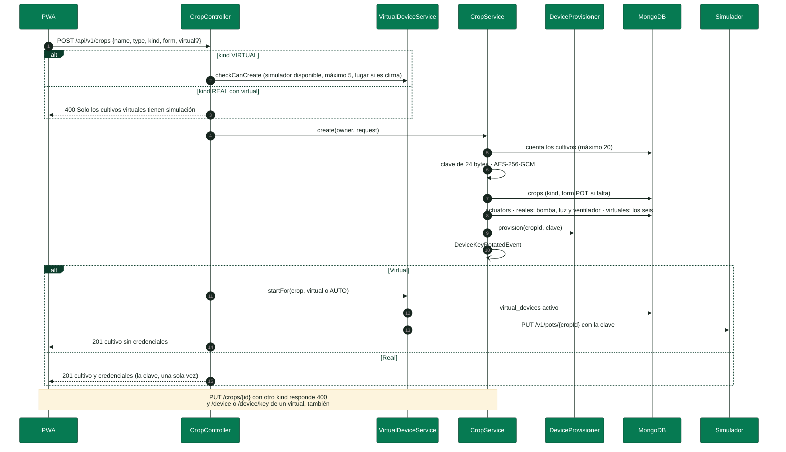
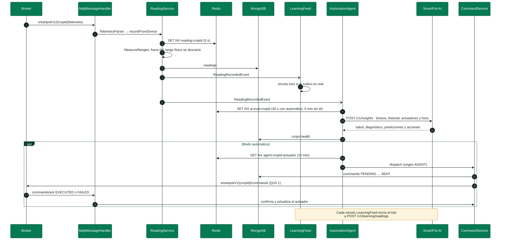
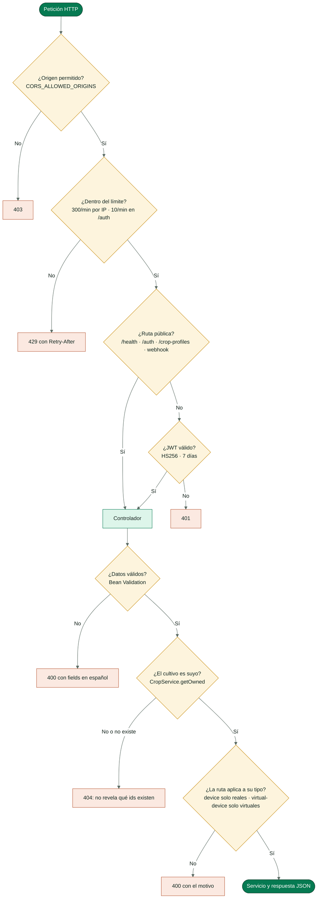

<!-- portada
eyebrow: Documentación del componente
titulo: SmartPot-API
acento: API
subtitulo: El centro de la plataforma SmartPot
bajada: REST con JWT, puente MQTT con el broker, cultivos reales y virtuales, agente de automatización con el asistente de IA, canales de notificación, seguridad, configuración y operación de la API.
documento: SmartPot-API
version: 1.0 · septiembre 2026
equipo: SmartPotTech
proyecto: smartpot.app
-->

# SmartPot-API

## Ficha del documento

| Campo | Valor |
| --- | --- |
| Proyecto | SmartPot · [smartpot.app](https://smartpot.app) |
| Componente | [SmartPot-API](https://github.com/SmartPotTech/SmartPot-API) |
| Versión | 1.0 · septiembre 2026 |
| Alcance | Dominios de la API, cultivos reales y virtuales, flujo de lecturas y comandos, seguridad, configuración, pruebas y operación |
| Documentación de la plataforma | [Documentación técnica](https://github.com/SmartPotTech/.github/blob/main/docs/SmartPot_Technical_Documentation.md), [recorrido del proyecto](https://github.com/SmartPotTech/.github/blob/main/docs/SmartPot_Project_Journey.md), [ciclo de vida](https://github.com/SmartPotTech/.github/blob/main/docs/SmartPot_Software_Lifecycle.md) y [diagramas generales](https://github.com/SmartPotTech/.github/blob/main/docs/README.md#diagramas-generales) |
| Mantenimiento | Se genera desde `docs/` de este repositorio con las herramientas de `.github/docs/tools`; se actualiza con cada cambio del componente |

<!-- parte: PARTE I | El componente -->

## 1. Propósito

### En palabras simples

La API es la única puerta de SmartPot. La PWA le habla por HTTPS; los dispositivos de los cultivos, por MQTT a través del broker. La API guarda las lecturas, le pregunta al asistente de IA cómo va cada cultivo, manda las órdenes a los actuadores, administra las cuentas MQTT de cada cultivo y avisa por la PWA y por Telegram. Todo lo que ve una persona pasa por aquí, siempre con su sesión y solo sobre sus propios cultivos.

| Responsabilidad | Cómo |
| --- | --- |
| Cuentas y sesión | Registro, ingreso con JWT, recuperación de contraseña por correo, perfil y borrado de la cuenta |
| Cultivos | Reales o virtuales (se elige al crear y no cambia), seis especies, cuatro formas y modo automático |
| Dispositivos | Cuenta MQTT por cultivo con clave de 192 bits cifrada con AES-256-GCM; aprovisionamiento en Mosquitto |
| Lecturas | Telemetría MQTT validada contra el rango físico de cada sensor, historial, resumen y CSV |
| Órdenes | Comandos con QoS 1, confirmación del dispositivo, vencimiento y órdenes en bloque |
| Asistente | Evaluación con SmartPot-AI, agente de automatización y envío de lecturas reales para el aprendizaje |
| Simulación | Configuración de los cultivos virtuales y proxy al simulador interno |
| Avisos | Notificaciones en la PWA y en Telegram, con canales intercambiables |

## 2. Arquitectura del componente

Cada dominio sigue las mismas capas (`controller`, `service`, `repository`, `mapper` y `model`). Los dominios se hablan con servicios y eventos de Spring (`ReadingRecordedEvent`, `CropDeletedEvent`, `DeviceKeyRotatedEvent`, `NotificationCreatedEvent`), así un cambio en uno no arrastra a los demás.

```mermaid
%%{init: {"theme": "base", "fontFamily": "Segoe UI, Arial, sans-serif", "themeVariables": {"fontFamily": "Segoe UI, Arial, sans-serif", "fontSize": "15px", "primaryColor": "#DDF5EA", "primaryTextColor": "#17261F", "primaryBorderColor": "#067A52", "secondaryColor": "#E3F2FB", "secondaryTextColor": "#17261F", "secondaryBorderColor": "#1F6FA0", "tertiaryColor": "#F2F7F4", "tertiaryTextColor": "#17261F", "tertiaryBorderColor": "#D5E3DC", "lineColor": "#5B6B63", "textColor": "#17261F", "mainBkg": "#DDF5EA", "nodeBorder": "#067A52", "clusterBkg": "#F7FAF8", "clusterBorder": "#D5E3DC", "edgeLabelBackground": "#FFFFFF", "actorBkg": "#067A52", "actorBorder": "#0B3D2B", "actorTextColor": "#FFFFFF", "actorLineColor": "#5B6B63", "signalColor": "#17261F", "signalTextColor": "#17261F", "labelBoxBkgColor": "#0B3D2B", "labelBoxBorderColor": "#0B3D2B", "labelTextColor": "#FFFFFF", "loopTextColor": "#0B3D2B", "noteBkgColor": "#FDF4DD", "noteBorderColor": "#C98D12", "noteTextColor": "#17261F", "activationBkgColor": "#DDF5EA", "activationBorderColor": "#067A52", "attributeBackgroundColorOdd": "#FFFFFF", "attributeBackgroundColorEven": "#F2F7F4"}, "layout": "elk", "elk": {"nodePlacementStrategy": "BRANDES_KOEPF", "mergeEdges": false, "cycleBreakingStrategy": "GREEDY"}}}%%
flowchart LR
  pwa["SmartPot-Web<br/>PWA"]
  tg["Telegram"]
  subgraph borde["Entrada HTTP"]
    direction TB
    sec["SecurityConfiguration<br/>CORS · JWT · rutas públicas"]
    rate["RateLimitingFilter<br/>300/min por IP · 10/min en auth"]
  end
  subgraph dominio["Dominios · controller → service → repository"]
    direction TB
    auth["security · users<br/>AuthService · UserService"]
    crops["crops<br/>CropService · real o virtual<br/>forma · clave del dispositivo"]
    readings["readings<br/>ReadingService · MeasureRanges"]
    actuators["actuators · commands<br/>ActuatorService · CommandService"]
    overview["overview<br/>totales · series · flota"]
    notif["notifications · channels<br/>ChannelDispatcher · TelegramBot"]
    virtual["virtualdevices<br/>VirtualDeviceService · SimulatorClient<br/>CropKindBackfill"]
    ai["ai<br/>AutomationAgent · LearningFeed<br/>InsightService · AiClient"]
  end
  subgraph mqtt["mqtt"]
    direction TB
    gateway["PahoMqttGateway<br/>MqttMessageHandler · TelemetryParser"]
    prov["DeviceProvisioner<br/>seguridad dinámica"]
  end
  mongo[("MongoDB")]
  redis[("Redis<br/>CacheStore")]
  broker["SmartPot-Broker"]
  aisvc["SmartPot-AI"]
  sim["SmartPot-DataGenerator"]
  smtp["SMTP<br/>MailService"]
  pwa -->|"REST + JWT"| rate --> sec --> dominio
  tg -->|"webhook firmado o sondeo"| notif
  notif -->|"Bot API"| tg
  dominio --> mongo
  rate & readings & ai --> redis
  auth --> smtp
  crops --> prov --> broker
  gateway <-->|"telemetría · comandos · ACK · estado"| broker
  gateway --> readings & actuators & crops
  readings -.->|"ReadingRecordedEvent"| ai
  ai -->|"POST /v1/insights · /v1/learning"| aisvc
  ai --> actuators --> gateway
  virtual -->|"PUT /v1/pots · token"| sim
  sim -->|"MQTT con la cuenta del cultivo"| broker
  classDef leaf fill:#DDF5EA,stroke:#067A52,color:#17261F
  classDef water fill:#E3F2FB,stroke:#1F6FA0,color:#17261F
  classDef sun fill:#FDF4DD,stroke:#C98D12,color:#17261F
  classDef clay fill:#FBE9E1,stroke:#B85A38,color:#17261F
  classDef core fill:#067A52,stroke:#0B3D2B,color:#FFFFFF
  classDef deep fill:#0B3D2B,stroke:#06281C,color:#FFFFFF
  classDef muted fill:#F2F7F4,stroke:#5B6B63,color:#17261F
  class pwa,tg,broker,aisvc,sim,smtp water
  class sec,rate sun
  class auth,crops,readings,actuators,overview,notif,virtual,ai leaf
  class gateway,prov core
  class mongo,redis muted
```

<!-- diagrama: SmartPot_API_Global_Component | titulo=SmartPot-API por dentro | lamina=H -->

| Paquete | Qué contiene |
| --- | --- |
| `security`, `users` | Filtros, JWT, límite de peticiones, AES-GCM, autenticación y perfil |
| `crops` | Cultivos, tipo y forma, modo automático y credenciales del dispositivo |
| `readings` | Lecturas, rangos físicos, resumen y exportación |
| `actuators`, `commands` | Actuadores de cada cultivo y ciclo de vida de las órdenes |
| `mqtt` | Cliente Paho, tópicos v1, parser de telemetría y aprovisionamiento en el broker |
| `ai` | Cliente de la IA, evaluación, agente de automatización y `LearningFeed` |
| `overview` | Panel general: totales, series con `$dateTrunc` y análisis de flota |
| `notifications`, `channels` | Alertas y canales externos (`NotificationChannel`, hoy Telegram) |
| `virtualdevices` | Simulación de los cultivos virtuales, reconciliación y completado de cultivos anteriores |
| `cache`, `mail`, `health`, `config` | Redis con respaldo en memoria, correo, `/health` y configuración |

## 3. Cultivos reales y virtuales

Al crear un cultivo se elige, una sola vez, de dónde vienen sus lecturas. Los dos tipos tienen cuenta en el broker; lo que cambia es quién la usa.

| Regla | Real | Virtual |
| --- | --- | --- |
| Quién publica | Un ESP32 con el firmware, físico o simulado en Wokwi | SmartPot-DataGenerator |
| Credenciales | Se entregan una vez y se pueden rotar | No se entregan: la API se las pasa al simulador por la red interna |
| Actuadores al nacer | Bomba, luz de cultivo y ventilador | Los seis |
| Rutas propias | `/device` y `/device/key` | `/virtual-device` (PUT cambia o reanuda, DELETE pausa) |
| Aprendizaje continuo | Sus lecturas entrenan los modelos | Sus lecturas no se envían |
| Límite | 20 cultivos por cuenta en total | Hasta 5 por cuenta |

<!-- diagrama: SmartPot_API_01_Crop_Creation | titulo=Crear un cultivo real o virtual -->

La forma (`POT`, `NFT`, `TOWER`, `RAFT`) solo decide cómo lo dibuja la PWA y se puede editar. Los cultivos creados antes de existir el tipo se completan al arrancar con `CropKindBackfill`: los que tenían simulación pasan a virtuales, el resto a reales, y sin forma quedan como maceta.

<!-- parte: PARTE II | Funcionamiento -->

## 4. De la lectura a la orden

<!-- diagrama: SmartPot_API_02_Reading_To_Command | titulo=De la lectura a la orden automática | lamina=H -->

| Regla | Valor |
| --- | --- |
| Lecturas por cultivo | Máximo una cada 5 s; las demás se descartan |
| Validación | Cada variable dentro del rango físico del sensor; si no, se descarta la lectura completa |
| Evaluación | Como máximo cada 30 s con modo automático y cada 5 min sin él |
| Enfriamiento del agente | 10 minutos por actuador |
| Vencimiento de un comando | 2 minutos sin ACK → `EXPIRED` y aviso |
| Lote de aprendizaje | Cada minuto, hasta 1000 lecturas por envío; la cola guarda 20 000 |

## 5. Seguridad de cada petición

<!-- diagrama: SmartPot_API_03_Request_Security | titulo=Qué revisa la API en cada petición -->

| Control | Detalle |
| --- | --- |
| Contraseñas | 8 caracteres a 72 bytes con mayúscula, minúscula y número; BCrypt de costo 12 |
| Recuperación | Responde 202 aunque el correo no exista; token de 30 minutos guardado como SHA-256 |
| Claves de los dispositivos | 24 bytes aleatorios, cifrados con AES-256-GCM; la llave es `SMARTPOT_AES_KEY` |
| Servicios internos | La IA y el simulador se llaman con token de servicio por la red interna |
| Telegram | Webhook con secreto comparado en tiempo constante; códigos de vinculación de un solo uso |

## 6. Contrato

La documentación interactiva vive en `/docs` y el esquema en `/v3/api-docs`; el [README](../README.md#contrato-rest) resume todas las rutas y la [documentación técnica](https://github.com/SmartPotTech/.github/blob/main/docs/SmartPot_Technical_Documentation.md) detalla el contrato MQTT v1.

| Grupo | Rutas |
| --- | --- |
| Público | `/health`, `/api/v1/auth/*`, `/api/v1/crop-profiles` |
| Cultivos | `/api/v1/crops`, `/crops/{id}`, `/crops/automation`, `/crops/{id}/device` |
| Datos del cultivo | `/readings`, `/actuators`, `/commands`, `/insights`, `/virtual-device` |
| Cuenta | `/api/v1/users/me`, `/notifications`, `/channels`, `/overview`, `/commands`, `/ai/learning` |

<!-- parte: PARTE III | Operación -->

## 7. Configuración

La API lee `.env` desde la carpeta del proyecto; `.env.example` lista todas las variables.

| Grupo | Variables |
| --- | --- |
| Servidor | `PORT`, `LOG_LEVEL`, `WEB_BASE_URL`, `PUBLIC_API_URL`, `CORS_ALLOWED_ORIGINS`, `API_DOCS_ENABLED` |
| Secretos | `SMARTPOT_JWT_SECRET` (32 caracteres o más), `SMARTPOT_AES_KEY` (AES-256 en Base64), `JWT_EXPIRATION` |
| Datos | `MONGODB_URI`, `REDIS_HOST`, `REDIS_PORT`, `REDIS_PASSWORD` |
| Correo | `MAIL_ENABLED`, `MAIL_HOST`, `MAIL_PORT`, `MAIL_USERNAME`, `MAIL_PASSWORD`, `MAIL_FROM` |
| MQTT | `MQTT_ENABLED`, `MQTT_BROKER_URI`, `MQTT_ADMIN_USERNAME`, `MQTT_ADMIN_PASSWORD`, `MQTT_PUBLIC_*`, `MQTT_WEBSOCKET_URL` |
| IA | `AI_ENABLED`, `AI_BASE_URL`, `SMARTPOT_AI_TOKEN`, `AI_EVALUATION_INTERVAL`, `AI_AUTOMATION_COOLDOWN`, `AI_LEARNING_*` |
| Telegram | `TELEGRAM_BOT_TOKEN`, `TELEGRAM_BOT_USERNAME`, `TELEGRAM_MODE` (`polling` o `webhook`), `TELEGRAM_WEBHOOK_SECRET` |
| Simulador | `SIMULATOR_ENABLED`, `SIMULATOR_BASE_URL`, `SIMULATOR_TOKEN` (sin él no se crean cultivos virtuales) |

> [!WARNING]
> **Llave AES.** Si `SMARTPOT_AES_KEY` se pierde o cambia, las cuentas MQTT no se pueden reconstruir: cada dueño debe rotar la clave de sus cultivos reales.

## 8. Pruebas

`./mvnw verify` corre 118 pruebas con JUnit y Mockito: cifrado, JWT, contraseñas, tópicos y telemetría MQTT, aprovisionamiento, comandos, cultivos con su tipo fijo y su forma, el agente, el envío de lecturas para el aprendizaje (solo reales), canales y bot de Telegram, la simulación de los virtuales (dueño, clave, límites, pausa y reconciliación), el completado de cultivos anteriores, la caché con respaldo local y la cadena de seguridad de los controladores. El E2E central de `.github` recorre la API completa con 35 comprobaciones.

## 9. Operación

| Tarea | Cómo |
| --- | --- |
| Estado | `GET /health` → base, broker, caché, IA y simulador (503 si la base cae) |
| Logs | `docker logs -f smartpot-api` |
| Imagen | `ghcr.io/smartpottech/smartpot-api`: compila en una etapa aparte, usuario `1000`, solo lectura con `tmpfs` en `/tmp` y `HEALTHCHECK` |
| Despliegue | Cada cambio en `main` pasa por el CI, publica la imagen y pide el despliegue central de `.github` |
| Rotar una clave | Pestaña Dispositivo de la PWA o `POST /api/v1/crops/{id}/device/key` (solo reales) |
